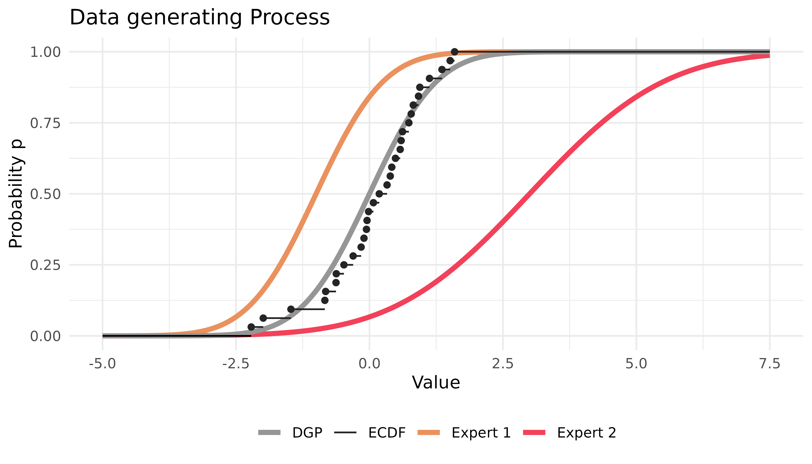
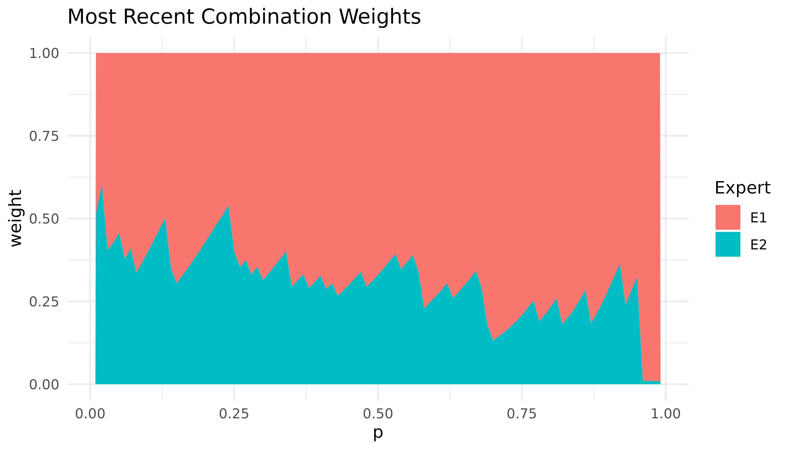
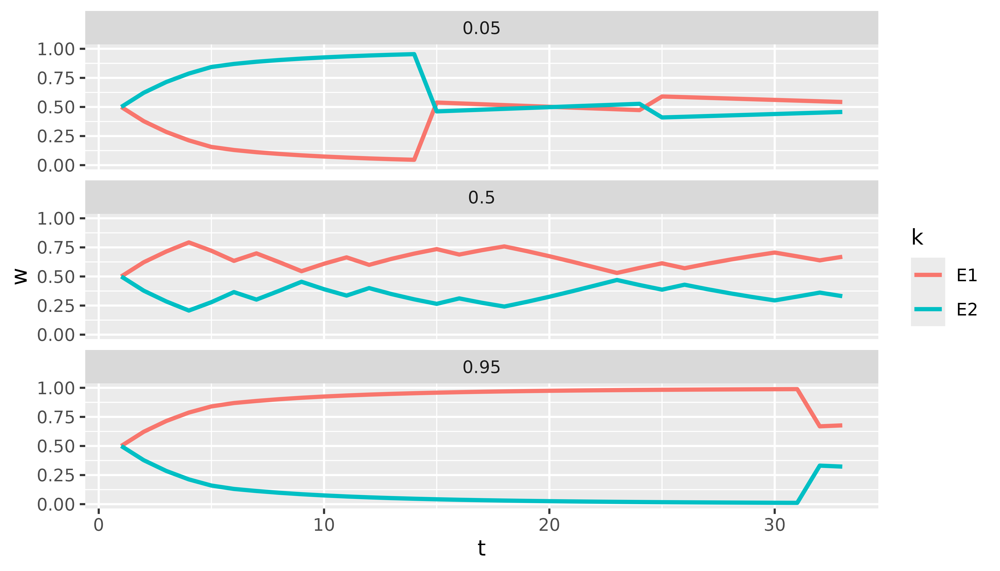
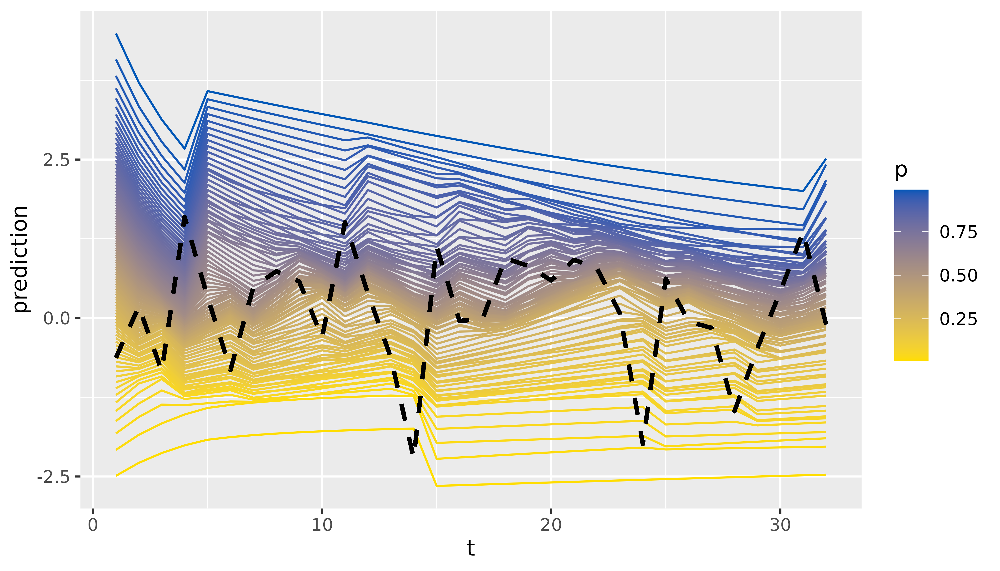

# Introduction

## A Short Introduction to profoc

**profoc** offers a user-friendly way to apply online-learning
algorithms for forecast combination. These algorithms reach fast
convergence rates while being very efficient. The monograph by
(Cesa-Bianchi and Lugosi 2006) is a great starting point for reading
about the theory behind these algorithms.

The algorithms are implemented in C++ and can be used in R via Rcpp
(Eddelbuettel 2013). The main function
[`online()`](https://profoc.berrisch.biz/dev/reference/online.md) offers
a high-level interface to the learning algorithms and their extensions.
It is a wrapper to the C++ class `conline`. The class functions as a
low-level interface. Its granularity allows for a high degree of
flexibility. We exposed it to offer maximum flexibility to advanced
users. We utilized Rcpp Modules (Eddelbuettel and François 2022) to
expose the class to R.

In this introductory vignette, we demonstrate the use of
[`online()`](https://profoc.berrisch.biz/dev/reference/online.md) to run
the core algorithms. We also show how the results can be inspected.
Various popular extensions of the core algorithms, methods for
deployment in production, and the low-level interface will be covered in
separate vignettes.

### Online Learning

For brevity, we consider a univariate probabilistic forecast combination
problem.

Let $\mathbf{y}$ be a vector of realized values of length
$\text{T} = 32$. Additionally, we have $\text{K} = 2$ probabilistic
expert forecasts for each observation in $\mathbf{y}$. These
probabilistic forecasts are equidistant grids of $\text{P}$ quantiles.
The goal is to combine the expert forecasts to obtain a combined
forecast ${\widetilde{y}}_{t|t - 1}$ for each observation $y_{t}$ in
$\mathbf{y}$. Formally:

$${\widetilde{y}}_{t|t - 1} = \sum\limits_{k = 1}^{K}w_{t,k}{\widehat{y}}_{t,k}.$$

Let’s simulate this setting in R before we apply the combination
algorithm.

``` r
set.seed(1)
T <- 2^5 # Observations
D <- 1 # Numer of variables
N <- 2 # Experts
P <- 99 # Size of probability grid
probs <- 1:P / (P + 1)

y <- matrix(rnorm(T)) # Realized observations

# Experts deviate in mean and standard deviation from true process
experts_mu <- c(-1, 3)
experts_sd <- c(1, 2)

experts <- array(dim = c(T, P, N)) # Expert predictions

for (t in 1:T) {
  experts[t, , 1] <- qnorm(probs, mean = experts_mu[1], sd = experts_sd[1])
  experts[t, , 2] <- qnorm(probs, mean = experts_mu[2], sd = experts_sd[2])
}
```

The situation can be depicted as follows:



Most parameters of
[`online()`](https://profoc.berrisch.biz/dev/reference/online.md)
contain sensible defaults. So, in this example, it is sufficient to
provide the data and the probability grid.

``` r
library(profoc)

combination <- online(
  y = y,
  experts = experts,
  tau = probs
)
```

The code above will compute the CRPS Learning algorithm described in
(Berrisch and Ziel 2021). This algorithm is based on Bernstein online
aggregation (Wintenberger 2017) and uses the quantile loss to calculate
weights on the probability grid. Other algorithms like `ewa` or
`ml-poly` can be computed by setting the `method` argument accordingly.

Printing the result object will present the loss of the experts and the
computed combination:

``` r
print(combination)
#>  Name        Loss     
#>  E1          0.4486700
#>  E2          0.9804200
#>  Combination 0.2925581
```

These are averages over time, the probability grid, and possibly all
marginals. The losses of the Experts and the Forecaster can be accessed
via `combination$experts_loss` and `combination$forecaster_loss`,
respectively.

We continue by inspecting the weights that were assigned during the
online learning process:

``` r
dim(combination$weights)
#> [1] 33  1 99  2
```

We can visualize the most recent weights with
[`autoplot()`](https://ggplot2.tidyverse.org/reference/autoplot.html):

``` r
autoplot(combination)
```



Expert one receives high weights, particularly in the right tail. This
is because the predictions of expert one are closer to the true DGP,
especially in the right tail.

We currently offer
[`tidy()`](https://generics.r-lib.org/reference/tidy.html) methods for
selected output elements (`weights`, `predictions`, `forecaster_loss`,
and `experts_loss`). These methods return a `tibble` for further
analysis. For example, we can easily plot the weights of both experts
for selected quantiles over time with just a few lines of code using
[dplyr](https://dplyr.tidyverse.org) and
[ggplot2](https://ggplot2.tidyverse.org):

``` r
library(dplyr)
library(ggplot2)

tidy(combination$weights) |>
  filter(p %in% c(0.05, 0.5, 0.95)) |>
  ggplot(aes(x = t, y = w, col = k)) +
  geom_line(linewidth = 1) +
  facet_wrap(~p, ncol = 1)
```



Finally, we can inspect and visualize the predictions:

``` r
tidy(combination$predictions)
#> # A tibble: 3,168 × 4
#>        t d         p prediction
#>    <int> <chr> <dbl>      <dbl>
#>  1     1 D1     0.01     -2.49 
#>  2     1 D1     0.02     -2.08 
#>  3     1 D1     0.03     -1.82 
#>  4     1 D1     0.04     -1.63 
#>  5     1 D1     0.05     -1.47 
#>  6     1 D1     0.06     -1.33 
#>  7     1 D1     0.07     -1.21 
#>  8     1 D1     0.08     -1.11 
#>  9     1 D1     0.09     -1.01 
#> 10     1 D1     0.1      -0.922
#> # ℹ 3,158 more rows

tidy(combination$predictions) |>
  ggplot(aes(x = t, y = prediction, group = p, colour = p)) +
  geom_line() +
  scale_color_continuous(low = "#FFDD00", high = "#0057B7") +
  # A little hacky way to add the realized values
  geom_line(aes(x = t, y = rep(y, each = 99)),
    linetype = "dashed", col = "black", linewidth = 1
  )
```



If you want to learn more on using
[`online()`](https://profoc.berrisch.biz/dev/reference/online.md) in
production for predicting and updating, refer to
[`vignette("production")`](https://profoc.berrisch.biz/dev/articles/production.md).

## References

Berrisch, Jonathan, and Florian Ziel. 2021. “CRPS Learning.” *Journal of
Econometrics*.

Cesa-Bianchi, Nicolo, and Gábor Lugosi. 2006. *Prediction, learning, and
games*. Cambridge university press.
<https://doi.org/10.1017/CBO9780511546921>.

Eddelbuettel, Dirk. 2013. *Seamless R and C++ Integration with Rcpp*.
Springer.

Eddelbuettel, Dirk, and Romain François. 2022. “Exposing c++ Functions
and Classes with Rcpp Modules.” *Vignette Included in R Package Rcpp,
URL Https://CRAN. R-Project. Org/Package= Rcpp*.

Wintenberger, Olivier. 2017. “Optimal Learning with Bernstein Online
Aggregation.” *Machine Learning* 106: 119–41.
